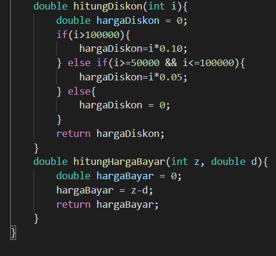

# **Laporan Pratikum Pertemuan 3**

Nama : Aldin Ariel Pramudya

NIM : 2141720233

Kelas : 1G/D4-TI

## Jawaban Pertanyaan--------------------------------------

### **Pertanyaan 3.2.3**

1. Tidak, karena di dalam suatu class harus mengandung atribut sebagai bagian dari class. Namun tidak diwajibkan untuk memiliki method. karena eksekusi rumus atau method dapat dilakukan di method main

2. Tidak, pemanggilan konstruktor dilakukan untuk melakukan reset pada setiap array yang akan diinputkan

3. Kode dibawah ini dimasukkan sebagai sebagai instansi objek array sebanyak 3
   > PersegiPanjang[] ppArray = new PersegiPanjang[3];

4. Kode ini digunakan untuk mengisi atribut pada objek array PersegiPanjang indeks ke 1
> ppArray[1]= new PersegiPanjang();
> 
> ppArray[1].panjang = 80;
> 
> ppArray[1].lebar = 40;

5. class main digunakan sebagai eksekusi setiap atribut pada class PersegiPanjang

### **Pertanyaan 3.3.3**

1. Array dua dimensi dapat diimplementasikan pada objek array

2. //ARRAY 2 DIMENSI//

3. Error muncul karena tidak ada pemanggilan konstruktor sebagai awal pemanggilan untuk indeks manakah yang akan diisi

4. Modifikasi inputan dengan scanner 
> Scanner sc = new Scanner(System.in);
> 
> int array;
>
> System.out.println("Masukkan Panjang Array : ");
> 
>array = sc.nextInt();
>
> PersegiPanjang[] ppArray = new PersegiPanjang[array];

5. Bisa, Namun program akan menjadi tidak efisien

### **Pertanyaan 3.4.3**

1. Bisa, Sebagai contoh adalah membuat konstruktor dengan parameter yang memiliki tipe data yang berbeda. Contohnya dapat dilihat pada Tugas Praktek Nomor 1 :

2. Source Code dapat dilihat pada Folder Source Coding 

### **Latihan Pratikum**

1. 

2. 

3. 

