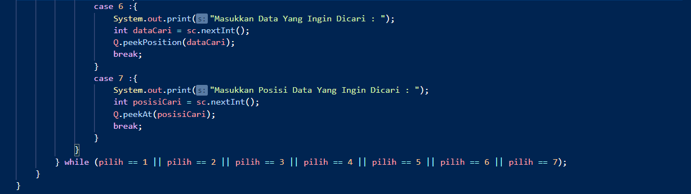
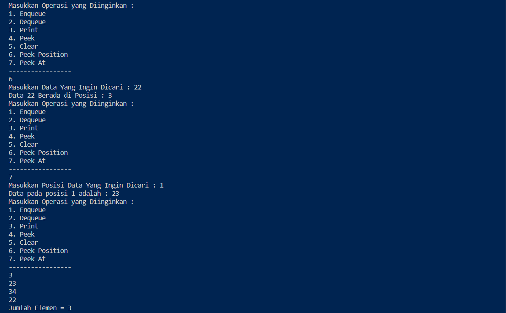
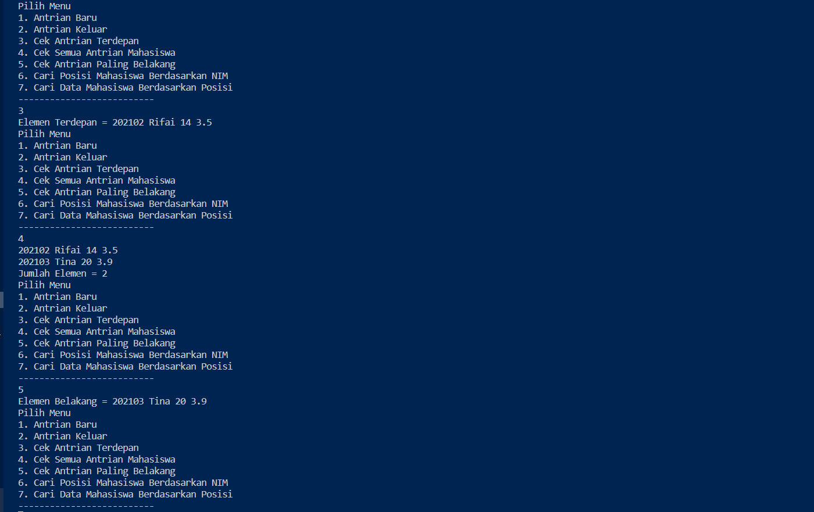

# Laporan Pratikum 8

Nama : Aldin Ariel Pramudya

NIM : 2141720233

Absen : 02

## Jawaban Pertanyaan 8.2.3
1. Front dan Rear diberikan nilai -1 dikarenakan menandakan posisi dari data pada stack yang masih kosong dan masih beluma ada data didalam stack dan dilambangkan dengan angka imajiner -1, sedangkan size 0 digunakan untuk menggambarkan panjang dari stack yang masih kosong
2. 
                 if(rear == max - 1){
                                rear = 0;

Potongan kode ini menyatakan apabila nilai rear == max - 1 atau dengan kata lain data terakhir telah memenuhi seluruh stack maka nilai rear adalah 0

3. 
                    if(front == max - 1){
                                front = 0;

Potongan kode ini menyatakan apabila nilai front == max - 1 atau dengan kata lain data awal atau data yang baru dimasukkan sama dengan nilai max atau data terakhir pada stack, maka nilai front adalah 0

4. Metode print menggunakan perulangan dimulai dari int i = front karena front merupakan data pertama yang dimasukkan dan menurut ciri queue yaitu First In First Out, data pertama ini yang akan muncul pertama kemudian dilanjutkan dengan data yang telah dimasukkan setelahnya

5. 
        i = (i+1) % max;

Bagian kode ini menyatakan iterasi untuk melakukan print data pada array dimana ketika i sudah pada indeks paling terakhir dari array, i akan kembali ke 0.

6. Potongan kode queue overflow adalah berikut 

                System.out.println("Masukkan data Baru : ");
                                int datamasuk = sc.nextInt();
                                Q.Enqueue(datamasuk);

7. Modifikasi queue underflow dan overflow 
   
class queue

        public int Enqueue(int dt) { 
                if (IsFull()) { 
                        System.out.println("Queue sudah penuh"); 
                        return 0; 
                        } else { 
                                if (IsEmpty()){ 
                                        front = rear = 0; 
                                        } else { 
                                                if (rear == max - 1) { 
                                                        rear = 0; 
                                                        } else { 
                                                                rear++; } 
                                                                } 
                                                                data[rear] = dt; 
                                                                size++; 
                                                                return 1; } 
                                                                }
   
class main

                        case 1:
                        System.out.print("Masukkan data baru: ");
                        int dataMasuk = sc.nextInt();
                        pilih = Q.Enqueue(dataMasuk);
                        break;
                        case 2:
                        int dataKeluar = Q.Dequeue();
                        if (dataKeluar != 0) {
                                System.out.println("Data yang dikeluarkan: " + dataKeluar);
                                break;
                        } else {
                                pilih = dataKeluar;
                                break;
                        }

## Jawaban Pertanyaan 8.3.3
1. 
                        if(!"".equals(data.norek) && !"".equals(data.nama) && !"".equals(data.alamat) && data.umur != 0 && data.saldo != 0){
                                System.out.println("Antrian Yang Keluar : " + data.norek + " " + " " + data.nama + " " + data.alamat + " " + data.umur + " " + data.saldo);
                                break;

Potongan kode di atas melakukan pemilihan bahwa apabila seluruh syarat sudah terpenuhi dimana data.norek, data.nama, data.alamat tersebut tidak bernilai kosong dan data.umur, data.saldo tidak bernilai 0, maka akan melakukan print atau menampilkan data yang telah diinputkan dari user.

2. Hasil Modifikasi

## Tugas 8.4

1. Modifikasi Pratikum 1

Modifikasi class queue

Modifikasi class main

Run 

2. Tugas 2

