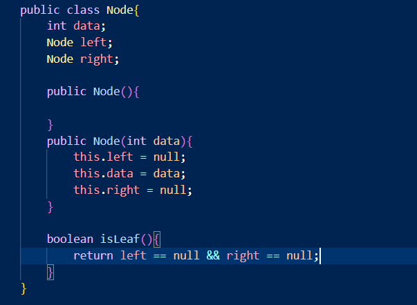

# Laporan Pratikum 13

Nama : Aldin Ariel Pramudya

NIM : 2141720233

Kelas : 1G/D4-TI

## Pertanyaan Percobaan 2.1.2

1. Karena dalam binary search tree ditujukan untuk pencarian. 
2. Pada class Node diberikan atribut left dan right agar seabgai pointer untuk menunjukkan data yang di sebelah kanan atau di sebelah kiri tree
3. 
    a. Atribut root atau akar menunjukkan node khusus yang tidak memiiliki predesesor atau elemen yan pertama
    b. Pada saat objek eprtama kali dibuat, nilai dari root adalah null
4. Apabila tree masih kososng dan akan ditambahkan node yang baru, maka akan dilakukan pengecekan apakah tree masih benar benar belum memiliki node kemudian dilakukan penambahan node baru yang secara otomatis akan menjadi root dari tree tersebut

5. Pada Method add() ini, pertama dilakukan pemilihan dengan syarat apabila nilai data kurang dari data current dan apabila nilai current pada bagian left tidak bernilai null maka current akan berpindah ke current.left. Apabila nilai current.left masih bernilai null maka akan ditambahkan node baru apda current.left kemudian dilakuakn break untuk keluar dari proses;

## Pertanyaan Percobaan 13.2.1
1. Kegunaan dari atribut data adalah untuk menunjukkan informasi data atau sebagai node pada tree dan idxLast merupakan variabel untuk menunjukkan index terakhir

2. Kegunaan method populateData() adalah untuk menampung nilai data/node tree dan idxLast sebagai index terakhir

3. Kegunaan method TraverseinOrder adalah untuk mengurutkan seluruh node yang terdapat array tree dengan menggunakan perulangan rekursif

4. Apabials sebuah node berada di indeks 2 dengan asumsi terdapat total 6 node dan index dimulai dari 0. Maka indeks untuk posisi left childnya akan berada di indeks ke-5 dan right child berada di indeks indeks ke-6

5. Kegunaan statement int idxLast = 6 adalah untuk menandakan indeks akhir atau node terakhir dari data array.

## Tugas Pratikum 13.3

1. Tambahkan method menambahkan node secara rekursif

2. Menampilkan Nilai Paling Kecil dan Paling Besar

3. Menampilkan Data pada Leaf
4. Menampilkan Jumlah Leaf dalam tree

5. Modifikasi Binary Tree
   
a. Method add(int data)

b. Method TraversePreOrder dan TraversePostOrder

