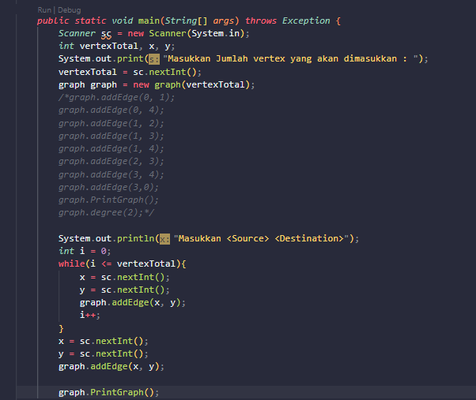
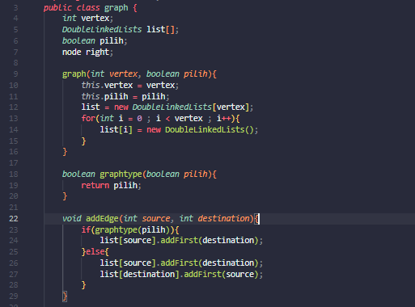
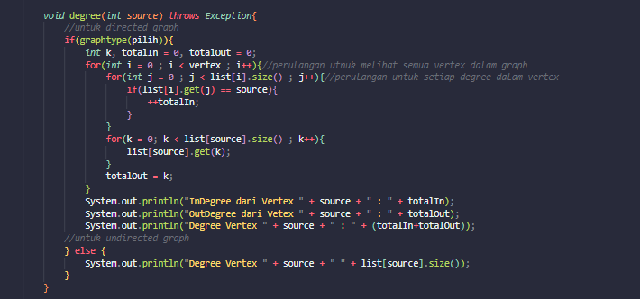
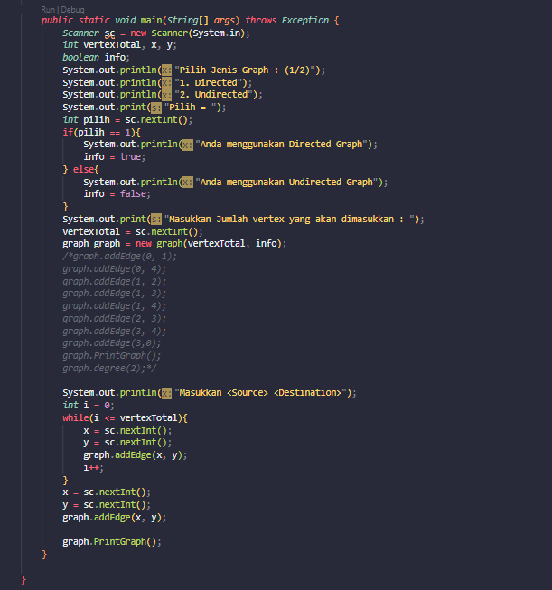
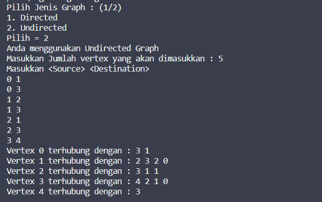
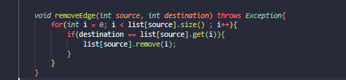
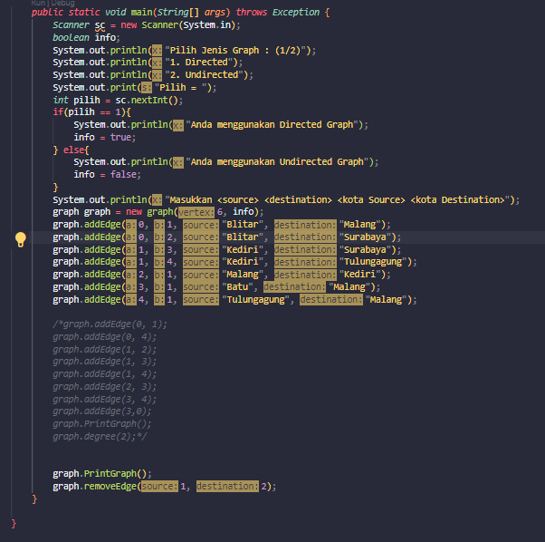
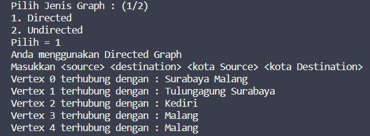

# Laporan Pratikum 15

Nama : Aldin Ariel Pramudya

NIM : 2141720233

Kelas : 1G/D4-TI

## Pertanyaan 2.1.3

1. Algoritma penggunaan graph dapat dilihat yang pertama

a. Navigasi Web Graph

Dengan menggunakan graph, proses perancangan struktur navigasi pada sebuah website akan lebih mudah dimana halaman-halaman utama yang dituju secara langsung atau direct akan dihubungankan melalui link menuju halaman index atau depan

b. Pencarian Lintasan Pendek dengan Algoritma Bellman-Ford

c. Pohon keputusan/Penyelesaian masalah

2. Tujuan pembuatan variabel Linkedlist list[] adalah penggunaan linkedlist array yang digunakan untuk menyimpan data-data untuk graph 

3. Alasan penggunaan dari method addFirst() adalah untuk mengenalkan data yang paling terdepan 

4. Cara untuk mendeteksi prev pointer dapat dengan cara melakuak looping edge dimana jika vertex lebih besar dari i dan destination 

5. Output yang diberikan tidak error namun lintasan yang dilewati oleh vertex akan mengalami perubahan

## Pertanyaan 2.2.3

1. Perbedaan degree pada directed dan undirected graph adalah pada undirected graph, degree tidak memiliki variabel dan hanya berisikan edge untuk setiap vertex yang ada, sedangkan pada directed graph, degree memiliki variabel arah untuk setiap edge yang menyambungkan edge yang ada 

2. Jumlah vertices ditambahkan satu adalah untuk mengiterasikan data dimulai dari 1 dikarenakan index dimulai dari 0

3. Kegunaan dari getEdge() adalah untuk mengembalikan nilai edge dari setiap pasangan vertex yang telah diinputkan 

4. Jenis graph yang digunakan adalah directed graph dikarenakan pada saat penggunaan edge terdapat variabel yang menunjukkan arah dimana terdapat variabel to dan variabel from yang menunjukkan vertex asal dan vertex tujuan 

5. Penggunaan try-catch Exception adalah untuk memudahkan user mengetahui masalah apabila terjadi error saat melakukan run dan program yang error dapat tetap berjalan

## Tugas Pratikum 3

1. Tugas 1
Code

Hasil Run

2. Tugas 2
class graph

class graphMain

Hasil Run

3. Tugas 3

4. Tugas 4

