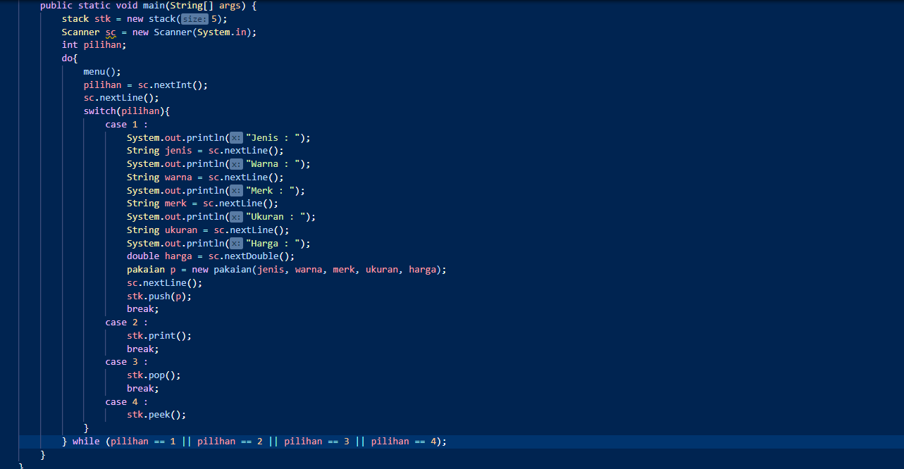
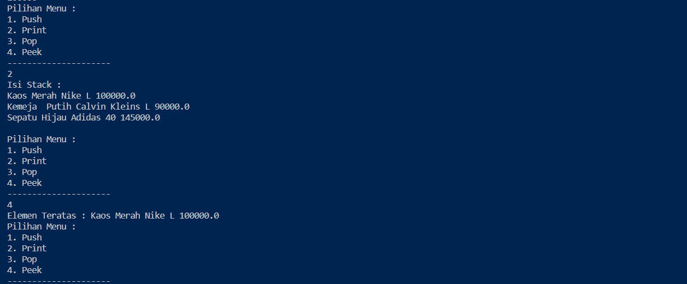
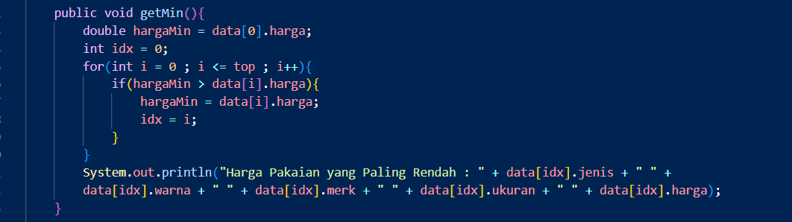
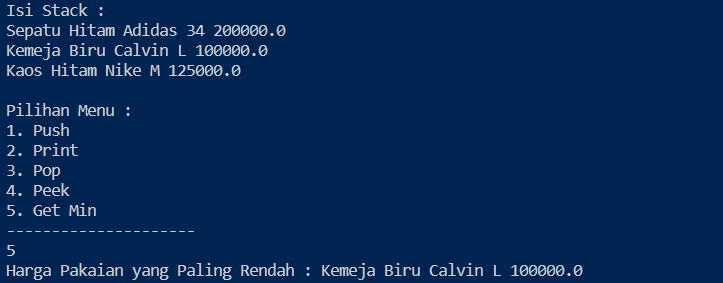
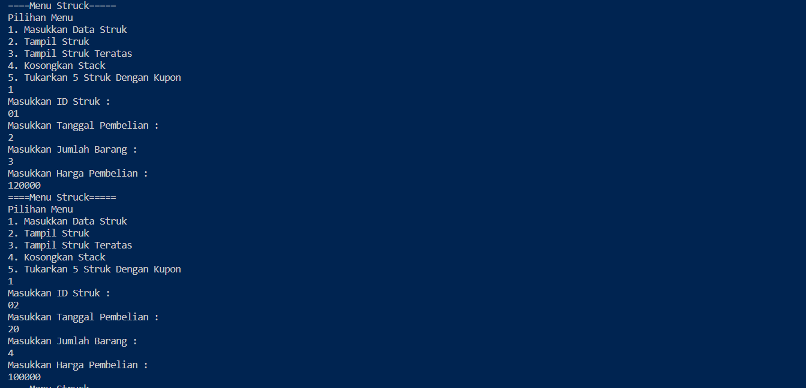

# Laporan Pratikum 9

Nama : Aldin Ariel Pramudya

NIM : 2141720233

Kelas : 1G/D4-TI

## Pertanyaan 7.2.3

1. Data yang dapat ditampung di dalam stack terdapat 5 data yang ditunjukkan pada kode berikut 
   
            stack stk = new stack(5);

2. Data yang tersimpan pada parameter p adalah data dari tipe data pakaian yang terdiri dari jenis, warna, merk, ukuran, harga yang berasal dari potongan kode berikut ini

        pakaian p = new pakaian(jenis, warna, merk, ukuran, harga);

3. Fungsi do while digunakan sebagai perulangan dalam pengisian data ke dalam stack. Apabila masih ingin mengisi data dapat memberikan input 'y' untuk melakukan perulangan dan selain 'y' untuk menghentikan perulangan

4. Modifikasi Pratikum 1

## Pertanyaan 7.3.2

1. Method derajat memberikan nilai untuk setiap operator matematika umum yang akan diinputkan oleh user. dimana nilai terbesar atau yang nantinya akan didahulukan adalah tanda pangkat yang dilanjutkan dengan perkalian dan pembagian kemudian pengurangan dan penambahan

2. c merrupakan variabel yang nilainya akan diinputkan dalam tipe data string dimana nilai tersebut masih dibatasi pada index perulangan

3. Hasilnya adalah 3586-^*3%

4. Tanda kurung tidak ditampilkan pada konversi dikarenakan tidak adanya tanda kurung menjadi persyaratan untuk konversi dilakukan 

## Tugas 7.4

1. Modifikasi Pratikum 1

2. Tugas 2

